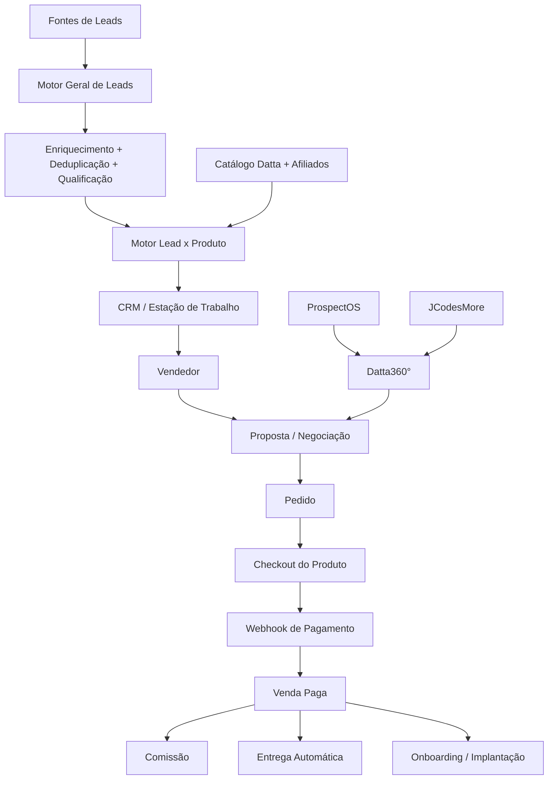

# DattaSeller

Central comercial da linha Datta.

## Objetivo

Construir o **DattaSeller** como uma estação comercial única para vendedores trabalharem leads, oportunidades, propostas e vendas sem operar diretamente as ferramentas técnicas que executam os produtos.

O DattaSeller recebe a base própria e novos prospects, enriquece e qualifica leads, cruza lead x produto, centraliza relacionamento comercial e registra pedido, pagamento, comissão e entrega.

> Princípio central: uma estação de vendas na frente; vários motores especializados trabalhando por trás.

## Arquitetura funcional

## Ferramentas registradas no projeto

- **DeskcommCRM:** estação operacional dos vendedores, contatos, empresas, pipeline, tarefas, histórico, WhatsApp e acompanhamento comercial.
- **OpenOutreach:** prospecção, descoberta, enriquecimento, qualificação e outbound geral.
- **ProspectOS:** motor especializado do Datta360° para encontrar oportunidades e gerar diagnóstico de presença digital.
- **JCodesMore:** geração de preview visual de modernização de site para propostas do Datta360°.
- **PostgreSQL:** persistência central com separação lógica entre módulos.
- **Redis:** filas e cache quando necessário.
- **Docker:** isolamento dos serviços e facilidade de migração.
- **Nginx ou Caddy:** proxy reverso e HTTPS.

## Catálogo comercial

Linha Datta registrada no projeto: DattaX, DattaSeg, DattaLEX, DattaGo, DattaVPS, DattaLead, DattaDig, DattaScore, DattaUrb e Datta360°.

- **DattaLead:** leads por nicho.
- **DattaDig:** produtos digitais.
- **Datta360°:** transformação digital 360° da presença da empresa, incluindo site, Instagram, Google Business, WhatsApp, CRM e automações compatíveis com o pacote contratado.
- **Afiliados e terceiros:** categoria separada no catálogo.

## Checkout e financeiro

Cada produto pode manter seu próprio checkout. O DattaSeller registra a venda e recebe o retorno do pagamento por integração/webhook. O vendedor não precisa acessar provedor de pagamento, conta bancária, credenciais administrativas ou administração interna do produto.

A comissão nasce sobre **venda paga**, não apenas sobre oportunidade marcada como ganha.

## Pós-venda

Há dois caminhos:

1. **Entrega automática:** produtos digitais, acessos, pacotes e SaaS quando tecnicamente possível.
2. **Implantação/onboarding:** serviços como Datta360°, que exigem coleta de dados, execução, aprovação e conclusão.

O pipeline comercial termina na venda. O pós-venda usa fluxo separado de pedido/entrega.

## Infraestrutura inicial registrada

- 1 VPS Linux
- 4 vCPU / 8 GB RAM como ponto inicial de validação
- 100–120 GB NVMe como referência inicial
- Docker
- PostgreSQL
- Redis quando necessário
- Nginx ou Caddy
- backups
- logs
- segredos isolados por serviço

A arquitetura deve permitir migrar serviços individualmente para outra VPS quando o volume exigir.

## Regra de produto

O vendedor deve enxergar **quem abordar, o que vender, por quê e qual próxima ação executar**. Ferramentas técnicas devem permanecer invisíveis sempre que possível.

## Gestão do projeto

A execução é controlada no Notion no projeto **DattaSeller — Projeto** e no banco **DattaSeller — Execução**.

Este repositório passa a ser a fonte versionada da documentação técnica e funcional do DattaSeller.