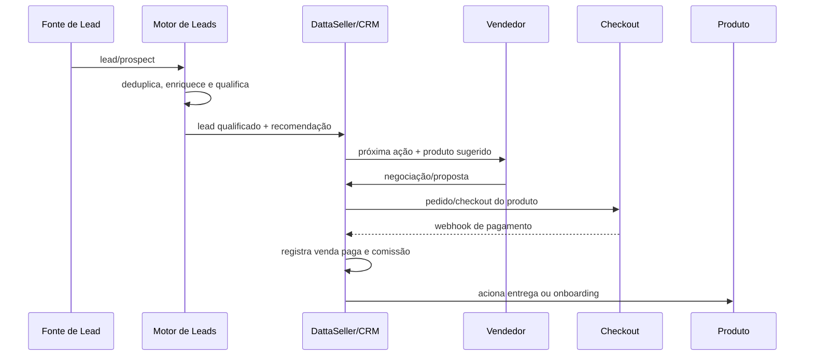
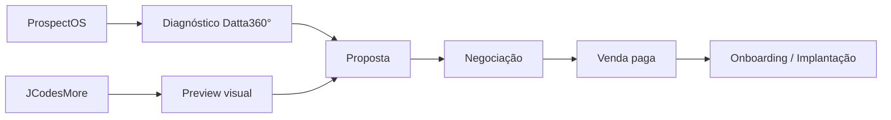
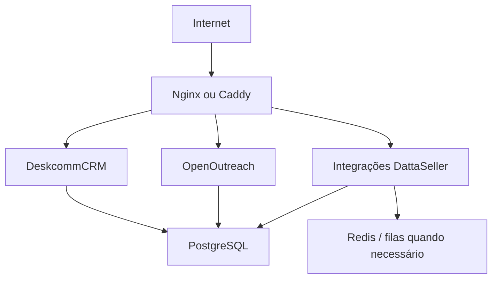

# DattaSeller — Arquitetura e Fluxos

## Fluxo principal

## Camadas

### 1. Aquisição e inteligência de leads
Fontes próprias e novos prospects alimentam um motor geral. OpenOutreach é a ferramenta registrada para prospecção, enriquecimento, qualificação e outbound geral. ProspectOS atua no caso especializado do Datta360°.

### 2. Match Lead x Produto
O sistema deve cruzar dados do lead com o catálogo Datta e de afiliados para responder quatro perguntas ao vendedor: quem abordar, o que vender, por quê e qual próxima ação executar.

### 3. CRM / estação comercial
DeskcommCRM é a estação operacional registrada no projeto para contatos, empresas, pipeline, tarefas, histórico, WhatsApp e acompanhamento comercial.

### 4. Proposta e venda
A negociação gera pedido e direciona o cliente ao checkout do produto correspondente. O DattaSeller não precisa centralizar inicialmente todos os meios de pagamento; deve receber confirmação por integração/webhook.

### 5. Comissão
Comissão só é reconhecida após confirmação de venda paga.

### 6. Pós-venda
Venda e pós-venda são fluxos separados. Produtos simples podem ter entrega automática; serviços complexos entram em onboarding/implantação.

## Datta360°

## Infraestrutura inicial

Referência inicial registrada no Notion: uma VPS Linux, 4 vCPU, 8 GB RAM e 100–120 GB NVMe, com Docker, backups, logs e segredos isolados. Isso é ponto inicial de validação, não dimensionamento definitivo de produção.