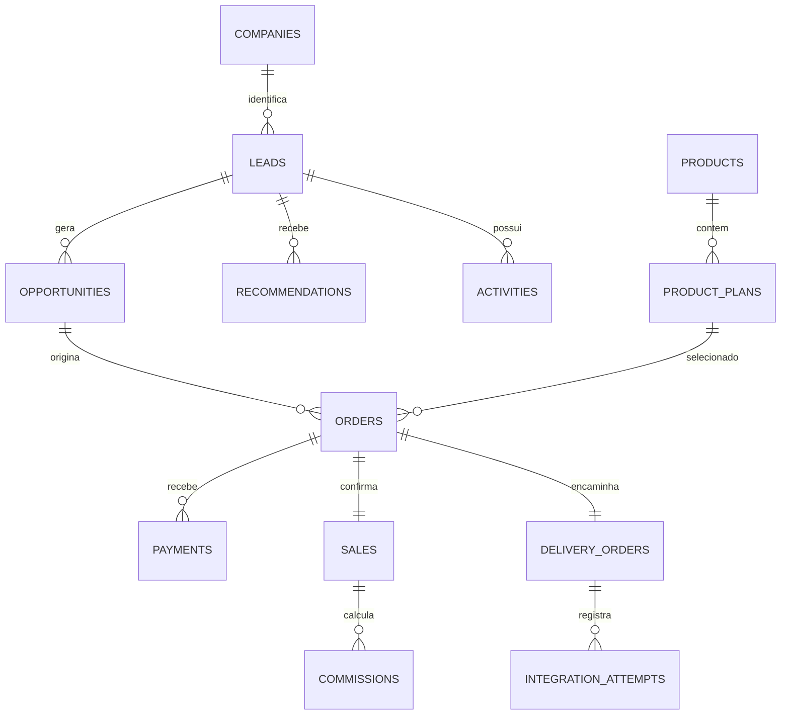

# Modelo de dados comercial

**Card:** CCD-7  
**Migration:** `db/migrations/001_commercial_core.sql`

O modelo guarda somente a jornada comercial. `external_product_key`, `external_plan_key`, `external_reference_id` e os payloads de integração são referências aos produtos de origem; não guardam configuração, tenant, servidor, IP, credencial, findings ou políticas deles.

## Regras preservadas no banco

- O telefone normalizado é único; sem telefone, o e-mail é único. Origens adicionais ficam em `lead_sources`.
- Uma oportunidade perdida exige `loss_reason`.
- O pagamento é idempotente por chave e por identificador externo do provedor.
- Uma venda pertence a um único pedido e a um pagamento pago.
- Uma entrega pertence a um pedido, tem estado próprio e mantém as tentativas de handoff.
- Auditoria registra antes/depois, ator, entidade e correlação.

## Aplicação da migration

O banco PostgreSQL ainda não foi provisionado no ambiente do Seller. Após CCD-2 e CCD-3, aplicar na ordem lexical com uma conta de migration separada da conta de runtime.
